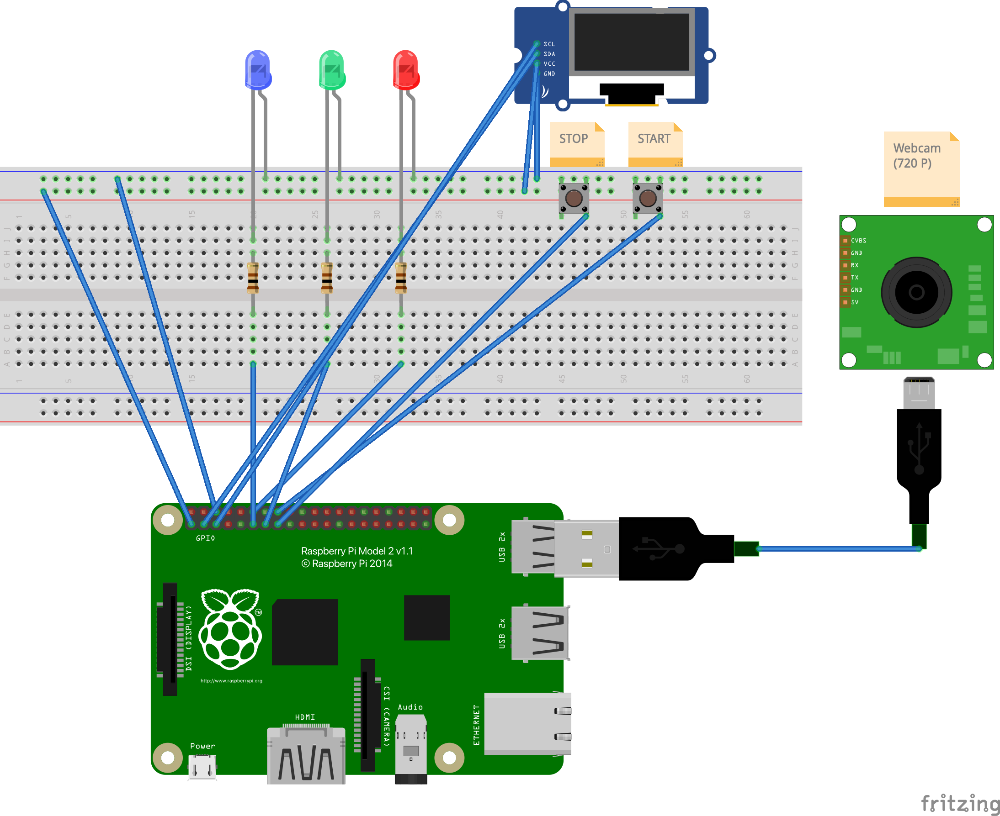
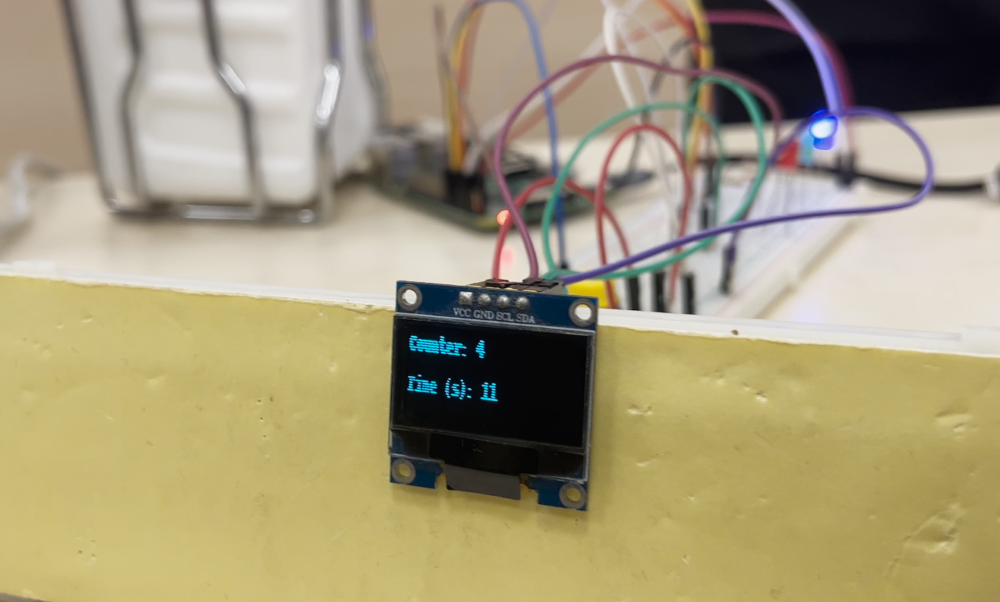
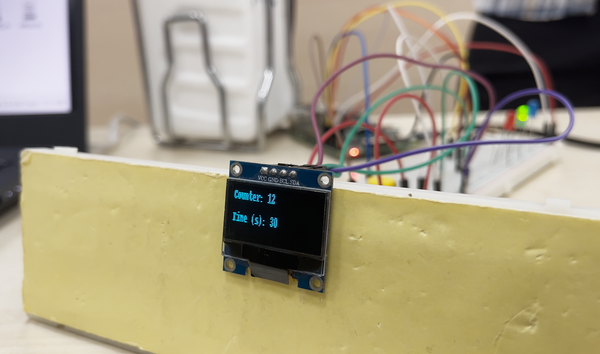
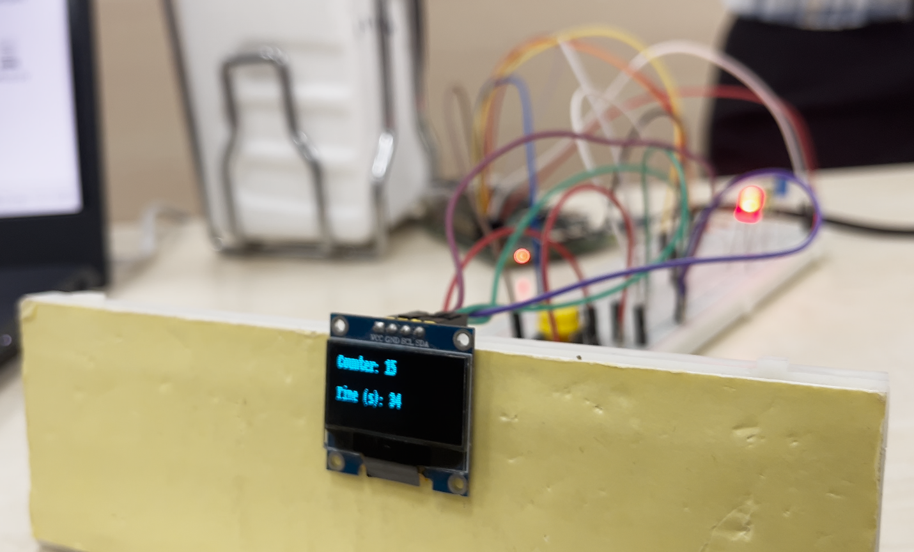
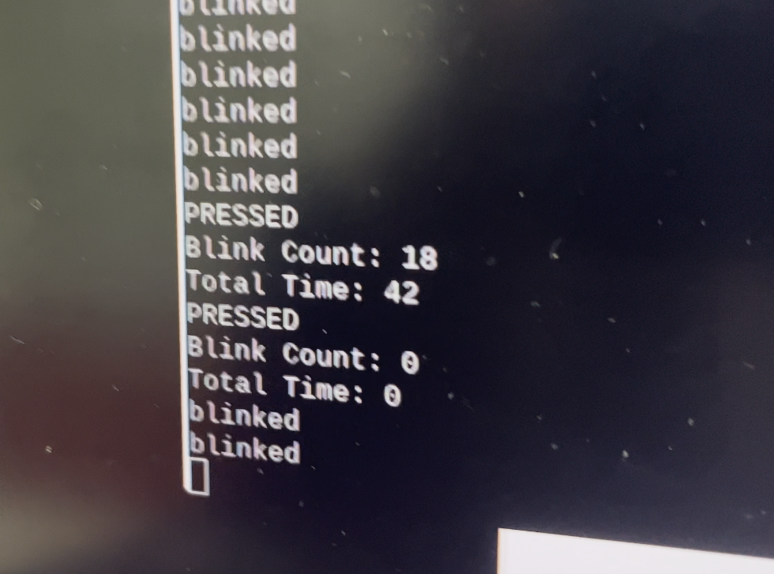

# Embedded Systems - Blink Counter System

## Description
```
An average person blinks 10-12 times per minute. Therefore, with the system we have designed, we can get meaningful results by using the "minute" as a unit, by which we can measure the amount of interest of the audience.

The system includes 3 LEDs and 1 OLED display for output display. Blue LED represents below-average blink, green LED represents average blink, and red LED represents above-average blink in 1 minute.

The instantaneous blink amount is shown on the OLED screen and the instantaneous seconds are shown below.
```

## System Desing (Fritzing)



## System Outputs

* Blue LED (4-9)


* Green LED (10-15)


* Red LED (15+)


* OLED Display

<br/><br/><br/><br/><br/>

## References

> [1] Ranti C, Jones W, Klin A, Shultz S. Blink Rate Patterns Provide a Reliable Measure of Individual Engagement with Scene Content. Sci Rep. 2020 May 19;10(1):8267. doi: 10.1038/s41598-020-64999-x. PMID: 32427957; PMCID: PMC7237680. <br/><br/>
[2] Xie, Xiaojiao & Song, Fanghao & Liu, Yan & Wang, Shurui & Yu, Dong. (2021). Study on the Effects of Display Color Mode and Luminance Contrast on Visual Fatigue. IEEE Access. PP. 1-1. 10.1109/ACCESS.2021.3061770. <br/><br/>
[3] Kim, Kangsoo & Erickson, Austin & Lambert, Alexis & Bruder, Gerd & Welch, Greg. (2019). Effects of Dark Mode on Visual Fatigue and Acuity in Optical See-Through Head-Mounted Displays. 1-9. 10.1145/3357251.3357584. <br/><br/>
[4] Sakai, T., Tamaki, H., Ota, Y., Egusa, R., Imagaki, S., Kusunoki, F., Sugimoto, M., & Mizoguchi, H. (2017). EDA-BASED ESTIMATION OF VISUAL ATTENTION BY OBSERVATION OF EYE BLINK FREQUENCY. In International Journal on Smart Sensing and Intelligent Systems (Vol. 10, Issue 2, pp. 1–12). Walter de Gruyter GmbH. https://doi.org/10.21307/ijssis-2017-212 <br/><br/>
[5] Unsworth, N., Robison, M.K. & Miller, A.L. Individual differences in baseline oculometrics: Examining variation in baseline pupil diameter, spontaneous eye blink rate, and fixation stability. Cogn Affect Behav Neurosci 19, 1074–1093 (2019). https://doi.org/10.3758/s13415-019-00709-z <br/><br/>
[6] Antonio Maffei, Alessandro Angrilli,  Spontaneous blink rate as an index of attention and emotion during film clips viewing, Physiology & Behavior, Volume 204, 2019, Pages 256-263, ISSN 0031-9384,  https://doi.org/10.1016/j.physbeh.2019.02.037.<br/><br/>
[7] P. Smith, M. Shah and N. da Vitoria Lobo, "Determining driver visual attention with one camera," in IEEE Transactions on Intelligent Transportation Systems, vol. 4, no. 4, pp. 205-218, Dec. 2003, doi: 10.1109/TITS.2003.821342.<br/><br/>
[8] Giuseppe Barbato, Vittoria De Padova, Antonella Raffaella Paolillo, Laura Arpaia, Eleonora Russo, Gianluca Ficca,  Increased spontaneous eye blink rate following prolonged wakefulness,  Physiology & Behavior,  Volume 90, Issue 1,  2007,  Pages 151-154,  ISSN 0031-9384,  https://doi.org/10.1016/j.physbeh.2006.09.023. <br/><br/>
[9] Tulen, J. H. M., Azzolini, M., de Vries, J. A., Groeneveld, W. H., Passchier, J., & van de Wetering, B. J. M. (1999). Quantitative study of spontaneous eye blinks and eye tics in Gilles de la Tourette’s syndrome. In Journal of Neurology, Neurosurgery &amp; Psychiatry (Vol. 67, Issue 6, pp. 800–802). BMJ. https://doi.org/10.1136/jnnp.67.6.800 <br/><br/>
[10] Jongkees, B. J., & Colzato, L. S. (2016). Spontaneous eye blink rate as predictor of dopamine-related cognitive function—A review. In Neuroscience &amp; Biobehavioral Reviews (Vol. 71, pp. 58–82). Elsevier BV. https://doi.org/10.1016/j.neubiorev.2016.08.020 <br/><br/>
[11] Kwon, K.-A., Shipley, R. J., Edirisinghe, M., Ezra, D. G., Rose, G., Best, S. M., & Cameron, R. E. (2013). High-speed camera characterization of voluntary eye blinking kinematics. In Journal of The Royal Society Interface (Vol. 10, Issue 85, p. 20130227). The Royal Society. https://doi.org/10.1098/rsif.2013.0227 <br/><br/>
